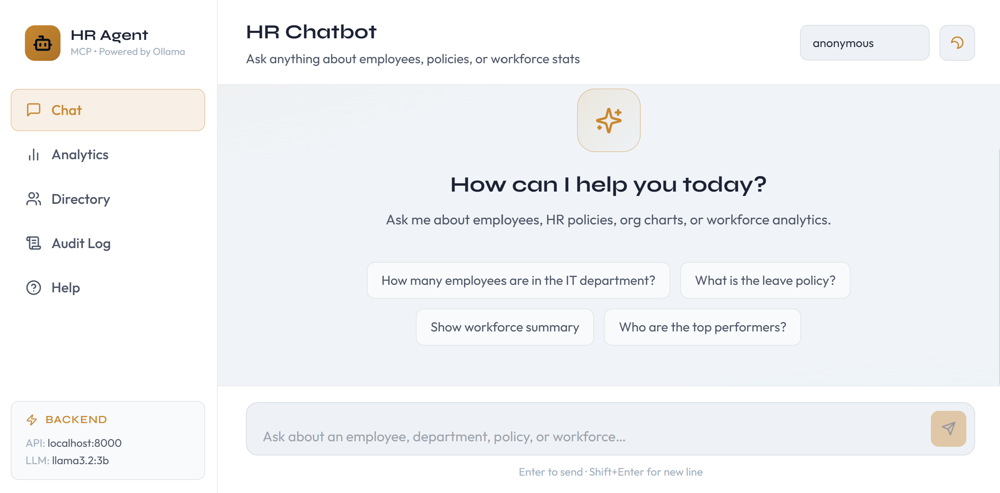

# 🤖 HR Agent – AI Powered HR Assistant

An **AI-powered HR Assistant** that helps employees and HR teams query company information such as employee details, HR policies, workforce analytics, and organizational structure using natural language.

The system uses **LLM + MCP (Model Context Protocol)** to connect an AI agent with structured HR tools like databases and policy knowledge bases.

---

# 📌 Features

### 💬 AI Chat Assistant

Ask natural language questions like:

* "Tell me about leave policy"
* "Show employees in Engineering"
* "Who reports to Michael Scott?"
* "Give me workforce summary"

The AI automatically selects the correct tool to answer the question.

---


### 🗂 HR Policy Knowledge Base (RAG)

HR policy PDFs are indexed into a **vector database**.

Example questions:

* "What is the leave policy?"
* "What is the remote work policy?"
* "What benefits are provided?"

---

### 🧾 Audit Logging

Every employee data query is logged for security.

Audit log contains:

* Timestamp
* Tool used
* Query
* User ID
* Result count

---


MCP Tools:
  - search_employees         : Flexible employee search (SQL-backed)
  - get_employee_details     : Full profile for one employee
  - get_department_analytics : Headcount, avg pay, performance by dept
  - get_org_chart            : Manager → direct-reports tree
  - get_workforce_summary    : Company-wide KPIs
  - search_hr_policy         : RAG over policy PDF knowledge base
  - log_audit_event          : Write to immutable audit trail

# 🏗️ Architecture

```
Frontend (Next.js)
        │
        ▼
FastAPI Backend
        │
        ▼
HR Agent
        │
        ▼
MCP Client
        │
        ▼
MCP HR Server
        │
 ┌──────┼───────────────┐
 ▼      ▼               ▼
SQLite   ChromaDB      Audit DB
Employees Policies     Logs
```


---

# ⚙️ Installation

### 1️⃣ Clone Repository

```
git clone https://github.com/yourusername/hr-agent.git
cd hr-agent
```

---

### 2️⃣ Create Python Environment

```
python -m venv venv
venv\Scripts\activate
```

---

### 3️⃣ Install Dependencies

```
pip install -r requirements.txt
```

Main dependencies:

* FastAPI
* LangChain
* Ollama
* ChromaDB

---

# 🤖 Install Ollama

Download and install:

https://ollama.com

Then pull model:

```
ollama pull llama3.1:8b
```

Start Ollama server:

```
ollama serve
```

---

# 📥 Load Data

### Ingest HR Policies

Place policy PDFs inside:

```
data/
```

Then run:

```
python ingest.py
```

---

### Ingest Employee Dataset

Place employee CSV in:

```
data/employees.csv
```

Run:

```
python ingest_employees.py
```

---

# 🚀 Running the Application

### Start Backend

```
cd backend
uvicorn api_server:app --port 8000
```

---

### Start Frontend

```
cd frontend
streamlit run streamlit_app.py
```

---

# 📊 Example Queries

### Employee Information

```
Show details for Jane Smith
```

### Workforce Analytics

```
Give me workforce summary
```

### Org Chart

```
Who reports to Michael Scott?
```

### HR Policy

```
What is the leave policy?
```

---

# 🖼️ Screenshots

### HR Chat Assistant



---


